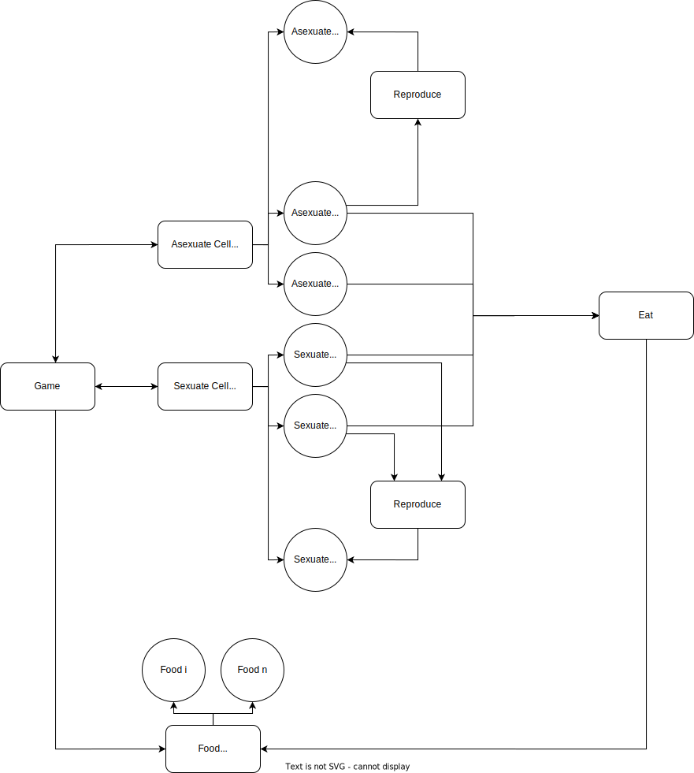

# Game of Life

## Functional Components

**1. Cell Generalities**
Cells can be of two types: ***sexuate & asexuate***.
They seek to eat and reproduce.
All cells start as full and after a time T_Full they become starved.
If a cell eats at least 10 times it reproduces, then becomes hungry again.
Each cell is a separate thread.

**2. Sexuate cells**
A sexuate cell reproduces with another sexuate cell, resulting in a third hungry cell.

**3. Asexuate cells**
An asexuate cell reproduces by division, resulting in two hungry cells.

**4. Food**
The food is limited.
A starved or full cell seeks food and if it doesn't find it it in at least T_Starve, it dies, spawning randomly 1 to 5 food units.

**5. Game**
Keeps track of the cells and food.
It simulates the interactions between the cells and the food (cell reproduction and eating).

## Non Functional Components

* The system should be able to maintain a number of cells at the same time.
* The system should be able to decide what happens if a cell finds a mate that found another mate.
* If two cells eat the same food then one thread will lock and the other one will wait.
* There is an upper bound of threads that can be created at any time.
* There will be at least 10 food units at the beginning of each game.
* There will be real-time output:
```
    [m:s:ms] cell #??? dies
    [m:s:ms] cell #??? eats food #???
    [m:s:ms] cells #??? and #??? reproduce -> cell #???
    ...
```
* Progress will be able to be saved in case of a long simulation

## Entities

```
Entity
|-- Cell: Entity
|   |-- Sexuate Cell: Cell
|   |-- Asexuate Cell: Cell
|-- Food: Entity
Game
```

## Collections

```
Game
|-- Sexuate Cells: ArrayList<Sexuate Cell>
|-- Asexuate Cells: ArrayList<Asexuate Cell>
|-- Food: ArrayList<Food>
```

## Diagram

<div style="background-color: #eeeeee">
    
</div>